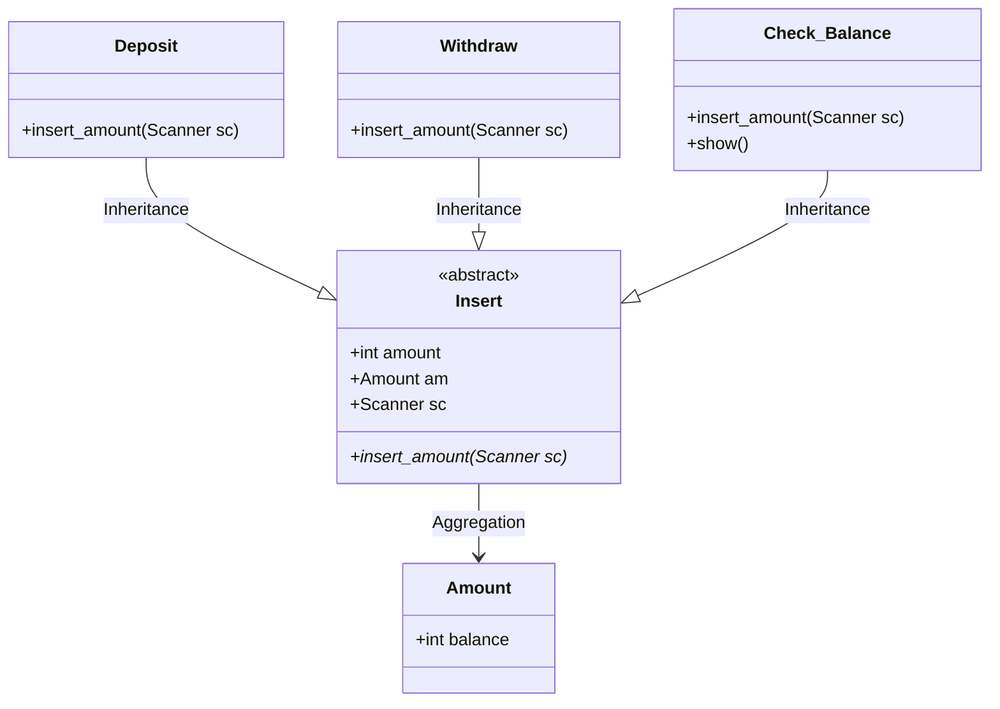
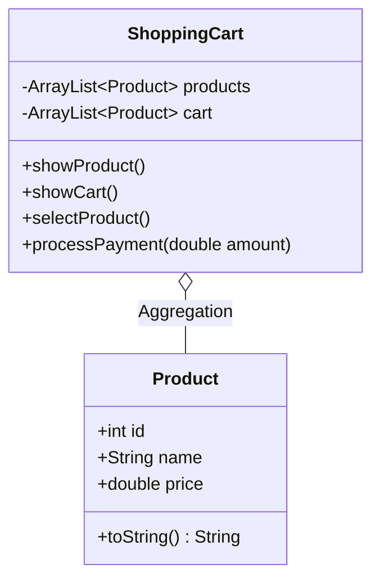
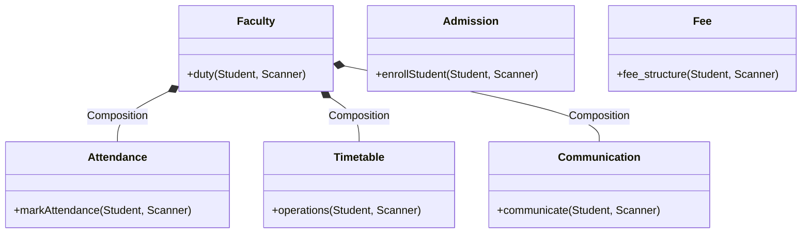

# ☕ Java OOP Real-World Systems


This repository contains robust, real-world system implementations built entirely using **Object-Oriented Programming (OOP)** concepts in Java. The goal of this project is to demonstrate how core OOP principles (Abstraction, Encapsulation, Inheritance, Polymorphism) are applied in designing modular and scalable applications.

---

## 🏗️ Systems Overview & Architecture

### 1. 🏦 ATM System

Simulates a fully functional ATM interface with secure PIN verification and transaction handling.

<details>
<summary><b>View Architecture Diagram</b></summary>



</details>

**Features:**

- PIN verification with account lock after 3 failed attempts
- Real-time Balance Check, Deposit, and Withdrawal

**OOP Concepts:** `Abstraction` (Insert class), `Inheritance` (Deposit, Withdraw), `Encapsulation` (Amount class).

---

### 2. 🛒 Online Shopping Cart

Simulates an interactive online shopping and checkout experience.

<details>
<summary><b>View Architecture Diagram</b></summary>



</details>

**Features:**

- Dynamic Product Listing & Cart Management
- Simulated Payment Gateway (Card / Cash on Delivery)

**OOP Concepts:** `Classes & Objects`, `Encapsulation` (Cart states), `Method Overriding` (toString).

---

### 3. 🎓 College Management System

Simulates a comprehensive college administration system.

<details>
<summary><b>View Architecture Diagram</b></summary>



</details>

**Features:**

- Student Enrollment & Fee Payment (UPI / Cheque / Cash)
- Attendance Tracking & Exam Eligibility Assessment
- Timetable Creation, Updates, and Parent Communication

**OOP Concepts:** `Composition` (Faculty manages Attendance/Timetable/Communication), `Modular Design`.

---

## 🛠️ Technologies Used

- **Language:** Java
- **Core Concepts:** Collections Framework (ArrayList), Date & Time API, Scanner for Standard I/O

## 📂 Project Structure

```text
src/main/java/org/example/Scenario/
│
├── ATM_System.java               # Entry point for the ATM System
├── Online_Shopping.java          # Entry point for the Shopping Cart
└── College_Management_System.java # Entry point for the College System
```

## 🚀 How to Run

### Prerequisites

- **Java Development Kit (JDK) 8** or higher installed.

### Steps

1. **Clone the repository:**
   ```bash
   git clone <repository_url>
   ```
2. **Navigate to the source directory:**
   ```bash
   cd src/main/java
   ```
3. **Compile the desired program:**
   ```bash
   javac org/example/Scenario/ATM_System.java
   ```
4. **Run the application:**
   ```bash
   java org.example.Scenario.ATM_System
   ```
   _(Replace `ATM_System` with `Online_Shopping` or `College_Management_System` to run the other applications)._

---

_Developed by **Krishna Narayan Singh** for practicing real-world Java system design._
